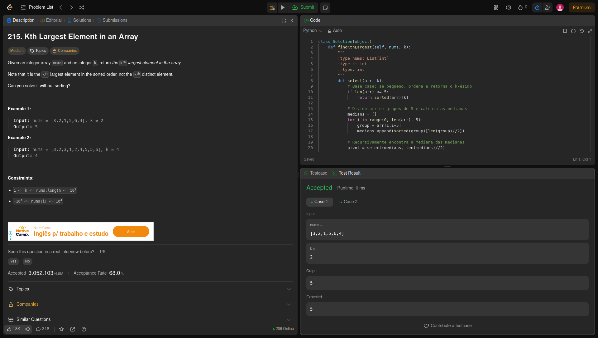
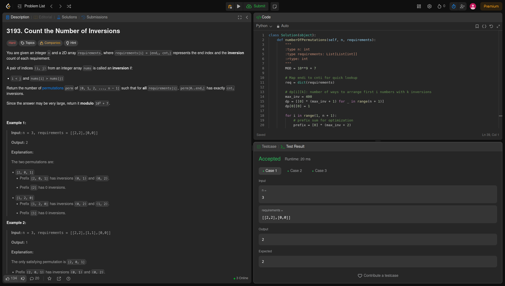

# Dividir_e_Conquistar

**Número da Lista**: 46<br>
**Conteúdo da Disciplina**: Dividir e Conquistar<br>

## Alunos
|Matrícula | Aluno |
| -- | -- |
| 222006712 | Fábio Gabriel da Silva Barbosa |
| 221022696 | Nathan Benigno Ponce de Abreu |


## Sobre 


### Questões Médias
| Título | Responsável | 
| -- | -- | 
| 215. Kth Largest Element in an Array | Fábio gabriel | 
|   | Nathan Abreu | 


### Questões Difíceis
| Título | Responsável | 
| -- | -- | 
| 3193. Count the Number of Inversions | Fábio Gabriel | 
|   | Nathan Abreu | 


## Screenshots
### [(Mediana da Medianas)](https://leetcode.com/problems/kth-largest-element-in-an-array/)



### [ (Contagem de inversões)](https://leetcode.com/problems/count-the-number-of-inversions/?utm_source=chatgpt.com)



### [(Interval Scheduling)]()


### [ (Caminhoneiro)]()


## Link do vídeo


## Guia de execução
### (Mediana_das_Medianas)
Abra o terminal e vá para pasta Fabio
```
cd ~/Dividir_e_Conquistar/Fabio
```
para executar
```
python mediana_das_medianas.py
```
Saida esperada:
```
Output: 5

```
###  (Contagem de inversões)
Abra o terminal e vá para pasta Fabio
```
cd ~/Dividir_e_Conquistar/Fabio
```
para executar
```
python Contagem_inversoes.py
```
Saida esperada:
```
Output: 2

```
## Instalação 
GCC instalado 
python instalado

**Linguagem**: C, Python <br>
