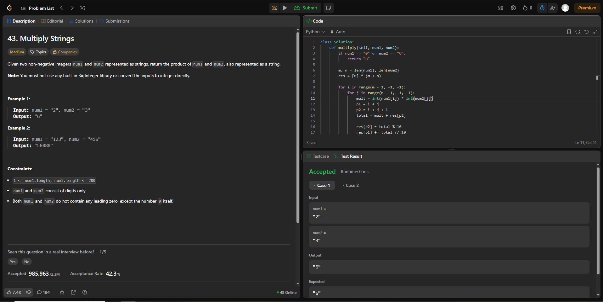
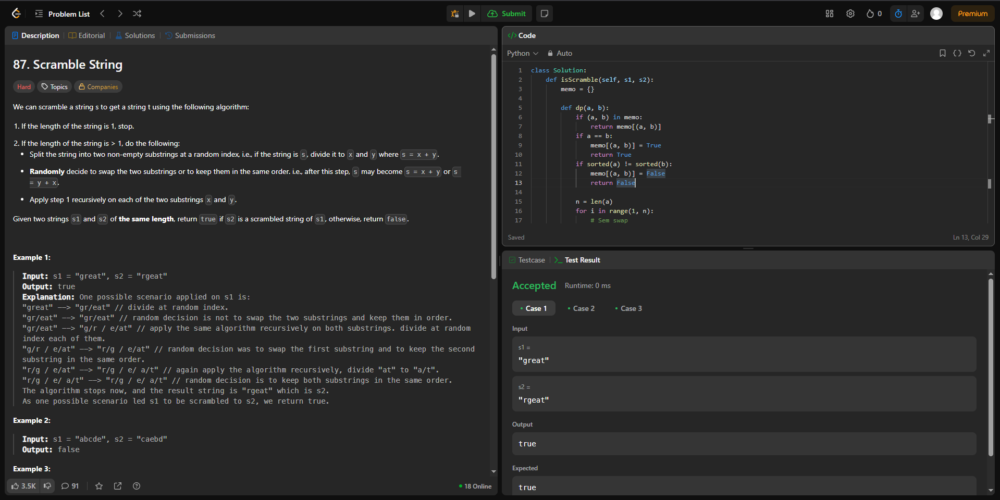

# Dividir_e_Conquistar

**Número da Lista**: 46<br>
**Conteúdo da Disciplina**: Dividir e Conquistar<br>

## Alunos
|Matrícula | Aluno |
| -- | -- |
| 222006712 | Fábio Gabriel da Silva Barbosa |
| 221022696 | Nathan Benigno Ponce de Abreu |


## Sobre 


### Questões Médias
| Título | Responsável | 
| -- | -- | 
| 215. Kth Largest Element in an Array | Fábio gabriel | 
| 43. Multiply Strings  | Nathan Abreu | 


### Questões Difíceis
| Título | Responsável | 
| -- | -- | 
| 3193. Count the Number of Inversions | Fábio Gabriel | 
| 87. Scramble String  | Nathan Abreu | 


## Screenshots
### [(Mediana da Medianas)](https://leetcode.com/problems/kth-largest-element-in-an-array/)


### [ (Contagem de inversões)](https://leetcode.com/problems/count-the-number-of-inversions/?utm_source=chatgpt.com)


### [(Karatsuba)](https://leetcode.com/problems/multiply-strings/description/)



### [(Strassen)](https://leetcode.com/problems/scramble-string/description/)




## Link do vídeo

https://www.youtube.com/watch?v=QMP0yqwWKV0


## Guia de execução
### (Mediana_das_Medianas)
Abra o terminal e vá para pasta Fabio
```
cd ~/Dividir_e_Conquistar/Fabio
```
para executar
```
python mediana_das_medianas.py
```
Saida esperada:
```
Output: 5

```
###  (Contagem de inversões)
Abra o terminal e vá para pasta Fabio
```
cd ~/Dividir_e_Conquistar/Fabio
```
para executar
```
python Contagem_inversoes.py
```
Saida esperada:
```
Output: 2

```


###  (Karatsuba)
Abra o terminal e vá para pasta Nathan
```
cd ~/Dividir_e_Conquistar/Nathan
```
para executar
```
python Karatsuba.py
```
Saida esperada:
```
Output: 6
```


###  (Strassen)
Abra o terminal e vá para pasta Nathan
```
cd ~/Dividir_e_Conquistar/Nathan
```
para executar
```
python Strassen.py
```
Saida esperada:
```
Output: True

```
## Instalação 
GCC instalado 
python instalado

**Linguagem**: Python <br>
